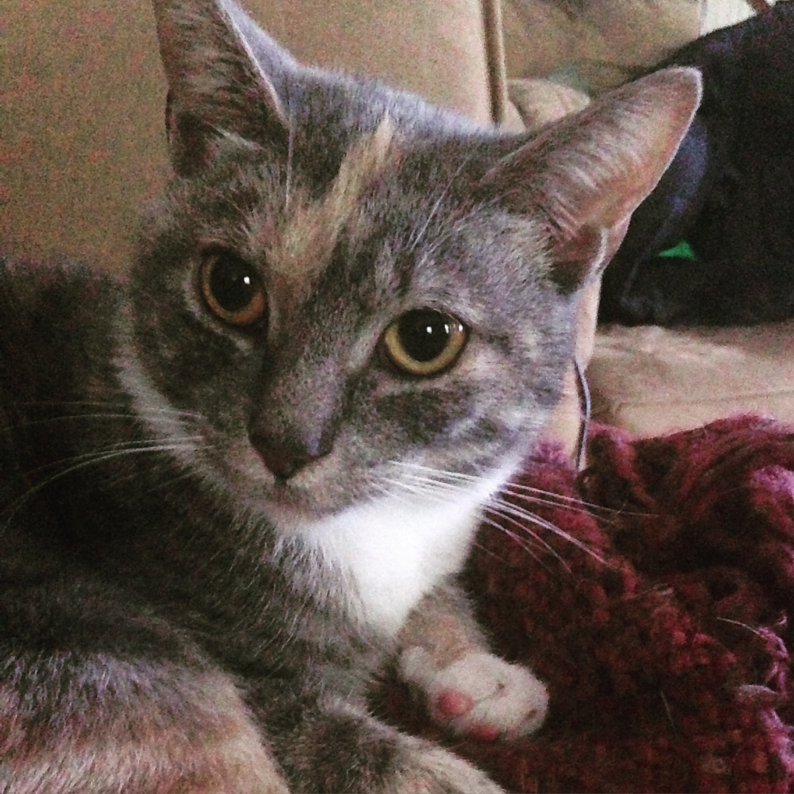

```{r child = "setup.Rmd"}
```

class: title-slide 

<br><br>

# Simple Linear Regression 
## Prediction

<br><br><br>

### Dr. Maria Tackett

---

## Topics 

--

- Predict the response given a value of the predictor variable

--

- Use intervals to quantify the uncertainty in the predicted values 
   
--

- Discuss why extrapolation is unwise when using a model for prediction

```{r packages}
library(tidyverse)
library(broom)
library(knitr)
library(kableExtra)
library(patchwork)
library(MASS)
```

---

## Cats data

The data set contains the **heart weight** (.term[Hwt]) and **body weight** (.term[Bwt]) for 144 domestic cats.

```{r echo = F}
ggplot(data = cats, aes(x = Bwt, y = Hwt)) +
  geom_point(alpha = 0.7) + 
  labs(x = "Body Weight (kg)",
       y = "Heart Weight (g)") +
  theme_bw() +
  theme(axis.title=element_text(size=14))
```

---

## Cats data

The weight of a cat's heart is used to determine the appropriate dosage for heart medicine.


```{r echo = F}
ggplot(data = cats, aes(x = Bwt, y = Hwt)) +
  geom_point(alpha = 0.7) + 
  geom_smooth(method = "lm", color = "blue", se = FALSE) +
  labs(x = "Body Weight (kg)",
       y = "Heart Weight (g)") +
  theme_bw() +
  theme(axis.title=element_text(size=14))
```

We want to fit a model so we can use a cat's body weight to predict how much its heart weighs.

---

## The model

.eq[
$$\hat{\text{Hwt}} = -0.357 + 4.034 \times \text{Bwt}$$
]

<br>

```{r echo = F}
bwt_hwt_model <- lm(Hwt ~ Bwt, data = cats)
bwt_hwt_model %>%
  tidy() %>%
  kable(format = "html", digits = 3)
```

---

class: regular

## Prediction

We can use the regression model to

--

1. Estimate the.vocab[<u>mean</u>] response when the predictor variable is equal to a value $x_0$

<br> 

--

2. Predict the response for an .vocab[<u>individual</u>] observation with a value of the predictor equal to $x_0$

---

## Calculating a predicted value

.pull-left[
My cat Mindy weighs about 3.18 kg (7 lbs). 

Based on this model, about how much does her heart weigh?
]

.pull-right[
```{r echo = F, out.height = '60%', out.width = '60%'}

```
]

--

.alert[
$$
\begin{align}
\hat{Hwt} &= -0.357 + 4.034 \times \color{purple}{\mathbf{3.18}} \\
&= \mathbf{12.471} \text{ grams}
\end{align}
$$
]

---

## Uncertainty in predictions

--

.eq[
**Confidence interval for the mean response**
$$\hat{y} \pm t_{n-2}^* \times \color{purple}{\mathbf{SE}_{\hat{\boldsymbol{\mu}}}}$$
]

--

.eq[
**Prediction interval for an individual observation**
$$\hat{y} \pm t_{n-2}^* \times \color{purple}{\mathbf{SE_{\hat{y}}}}$$
]

---

## Standard errors

--

.eq[
$$SE(\hat{\mu}) = \hat{\sigma}\sqrt{\frac{1}{n} + \frac{(x-\bar{x})^2}{\sum\limits_{i=1}^n(x_i - \bar{x})^2}}$$
]

--

.eq[
$$SE(\hat{y}) = \hat{\sigma}\sqrt{\mathbf{\color{purple}{1}} + \frac{1}{n} + \frac{(x-\bar{x})^2}{\sum\limits_{i=1}^n(x_i - \bar{x})^2}}$$
]

---

## Confidence interval

The 95% .vocab[confidence interval] for the .vocab[*mean*] heart weight of cats that weigh 3.18 kg is

```{r}
x0 <- data.frame(Bwt = c(3.18))
predict(bwt_hwt_model, x0, interval = "confidence", #<<
           conf.level = 0.95) %>% 
  kable(format = "html", digits = 3)
```
<br> 

--

.alert[
We are 95% confident that mean heart weight for cats that weigh 3.18 kg is between 12.143 g and 12.801 g.
]
---

## Prediction interval

The 95% .vocab[prediction interval] for an .vocab[*individual*] cat that weighs 3.18 kg is

```{r}
predict(bwt_hwt_model, x0, interval = "predict",
           conf.level = 0.95) %>%
  kable(format = "html", digits = 3)
```
<br> 

--

.alert[
We are 95% confident the heart weight for an individual cat that weighs 3.18 kg is between 9.582 g and 15.362 g.
]

---

## Comparing intervals

```{r}
pred_int <- as_tibble(predict(bwt_hwt_model, newdata = data.frame(Bwt = cats$Bwt), interval = "predict")) %>%
  rename(lower_pred = lwr, 
         upper_pred = upr) %>%
  dplyr::select(-fit)

conf_int <- as_tibble(predict(bwt_hwt_model, interval = "confidence")) %>%
  rename(lower_conf = lwr, 
         upper_conf = upr) %>%
  dplyr::select(-fit)
  
cats <- bind_cols(cats, pred_int)
cats <- bind_cols(cats, conf_int)
```

```{r echo = F, fig.height = 4}
colors <- c("conf" = "blue", "pred" = "red")
ggplot(data = cats, aes(x = Bwt, y = Hwt)) +
  geom_point(alpha = 0.5) + 
  geom_smooth(method = "lm", color = "gray", se = FALSE) +
  geom_line(aes(y = lower_pred, color = "pred"), linetype = "dashed") + 
  geom_line(aes(y = upper_pred, color = "pred"), linetype = "dashed") + 
  geom_line(aes(y = lower_conf, color = "conf")) + 
  geom_line(aes(y = upper_conf, color = "conf")) +
  labs(x = "Body Weight (kg)",
       y = "Heart Weight (g)") +
  theme_bw() +
  scale_color_manual(values = colors, 
                     labels = c("Confidence interval for mean", "Prediction interval for individual"), 
                     name = "") +
  theme(legend.position = "top", 
        legend.text = element_text(size = 20), 
        axis.title=element_text(size=14))
```

---

## Caution! Extrapolation 

We should **<u>not</u>** use the model to predict for values of $X$ far outside the range of values used to fit the model. This is called .vocab[extrapolation]. 

--

If we extrapolate, the predictions are unreliable since we can't be sure the same linear relationship holds outside of the range of values in our data set.

---

## Predict Andy's heart weight?

.pull-left[
My cat Andy weighs about 5.44 kg (12 lbs).

<br>

Should we use this regression model to predict his heart weight? 
]

.pull-right[
```{r echo = F, out.height = '75%', out.width = '75%'}

```
]

---

## Predict Andy's heart weight?

```{r}
ggplot(data = cats, aes(x = Bwt, y = Hwt)) +
  geom_point(alpha = 0.5) + 
  geom_vline(xintercept = 5.4, color = "red") +
  labs(x = "Body Weight (kg)",
       y = "Heart Weight (g)") +
  annotate("text", x = 5.2, y = 17, label = "Andy", color = "red") +
  theme_bw() +
  theme(axis.title=element_text(size=14))
```

--

.center[
We should **<u>not</u>** use this model to predict Andy's heart weight, since that would be .vocab[extrapolation].
]

---

## Recap

--

- Predicted the response given a value of the predictor variable

--

- Used intervals to quantify the uncertainty in the predicted values 
    - Confidence interval for the mean response
    - Prediction interval for individual response

--

- Discussed why extrapolation is unwise when using a model for prediction
